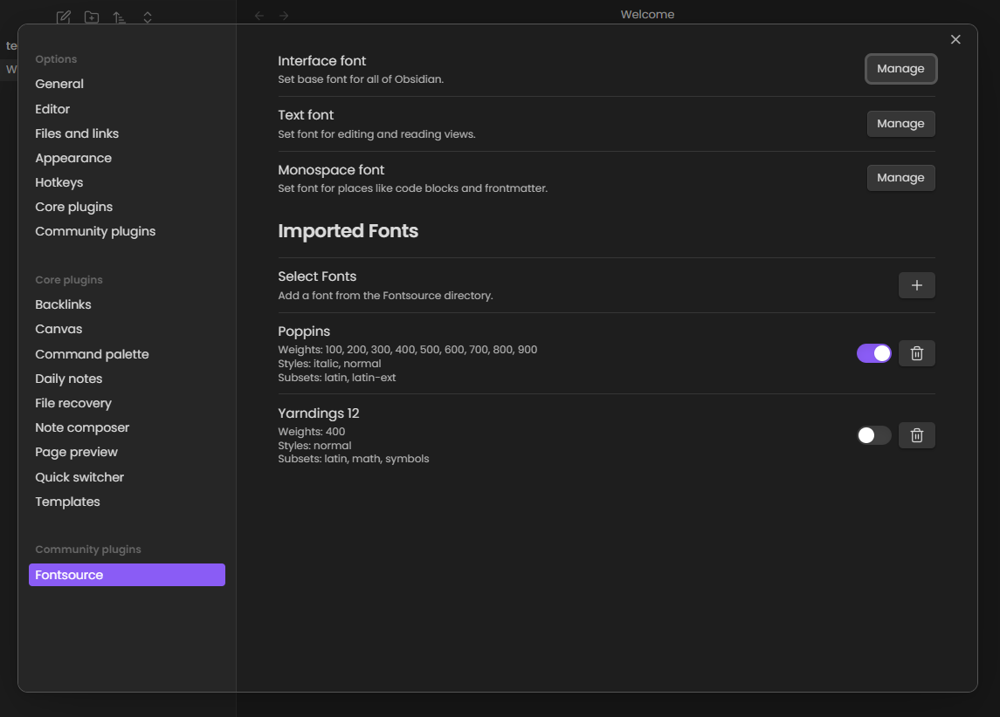

# Obsidian fontsource

This is a simple plugin to import [Fontsource](https://fontsource.org/) custom fonts into Obsidian.

## Contribution

Pull requests are welcome. For major changes, please open an issue first to discuss what you would like to change.

## License

[MIT](LICENSE)
