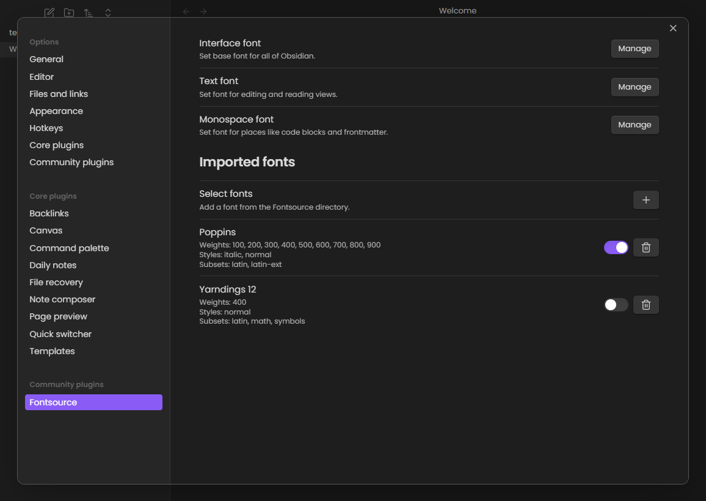

# Fontsource for Obsidian

This is a simple plugin to import [Fontsource](https://fontsource.org/) custom fonts into Obsidian.

## Contribution

Pull requests are welcome. For major changes, please open an issue first to discuss what you would like to change.

Releasing a new version is done by creating a new tag and pushing it to the repository. The GitHub Actions workflow will build and release the necessary files.

## License

[MIT](LICENSE)
